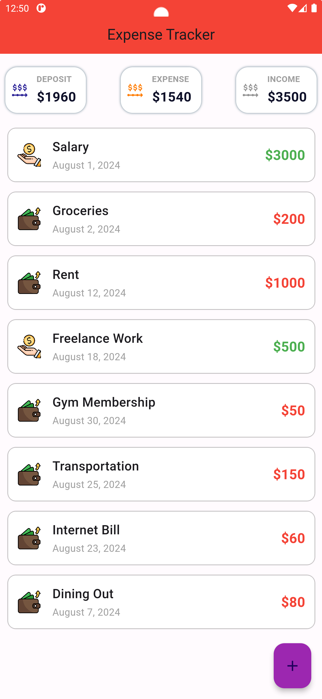
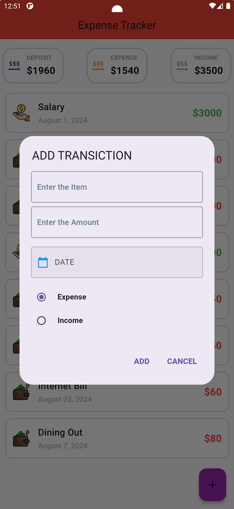
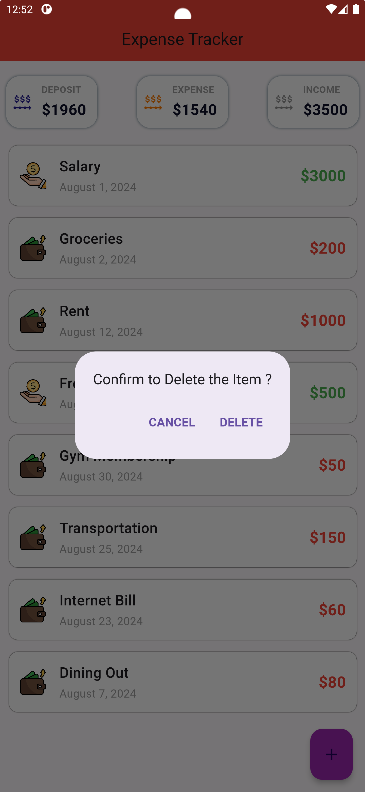

# Expense Tracker App

## Project overview

A beautiful and intuitive Expense Tracker App built with Flutter, allowing you to manage your daily expenses and income with ease. This app provides a simple interface to add and delete transactions, track your financial activity, and maintain control over your budget.

## Features

- **Add Transactions:** Easily add income or expense transactions by entering the item name, amount, date, and type (Income/Expense).
- **Delete Transactions:** Remove transactions from the list with a simple delete function.
- **Track Finances:** View your total income, total expenses, and the remaining balance (deposit).
- **User-Friendly Interface:** Clean and responsive design for seamless user experience.
- **Multi-Purpose Usage:** Perfect for personal finance management, tracking Shopee expenses, or even managing shared expenses at home.

## Usage

1. **Adding a Transaction:**
   - Click on the "Add" button to bring up the dialog.
   - Enter the item name, amount, date, and choose whether it’s an income or expense.
   - Confirm to add the transaction to your list.

2. **Deleting a Transaction:**
   - Swipe left or right on a transaction in the list to reveal the delete option.
   - Confirm the deletion to remove the transaction from your records.

3. **Viewing Summary:**
   - The homepage provides a summary of your total income, expenses, and the remaining deposit.

## Screenshots

- **Homepage / List of Items:**
  

- **Adding a Transaction:**
  

- **Deleting a Transaction:**
  

